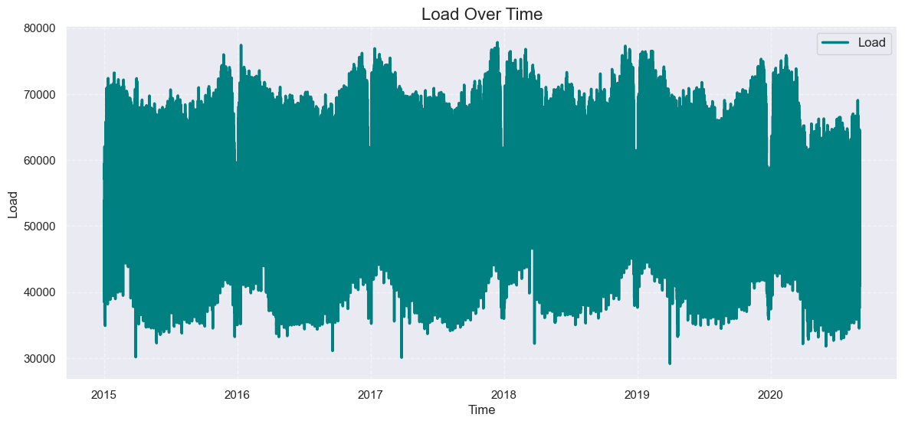
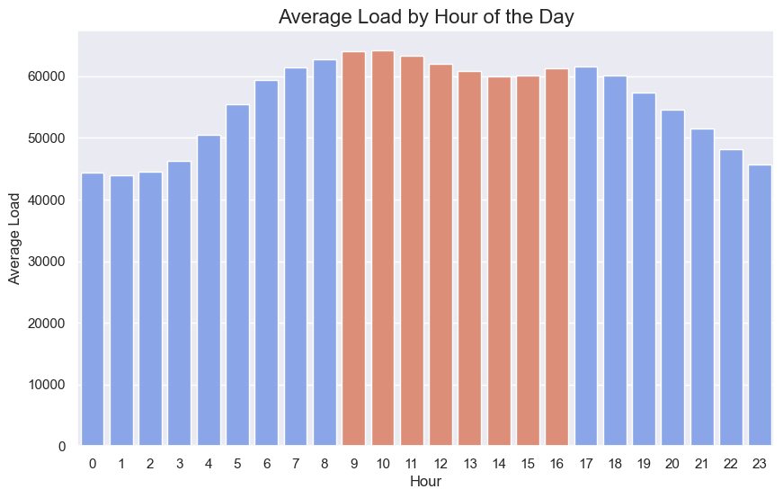
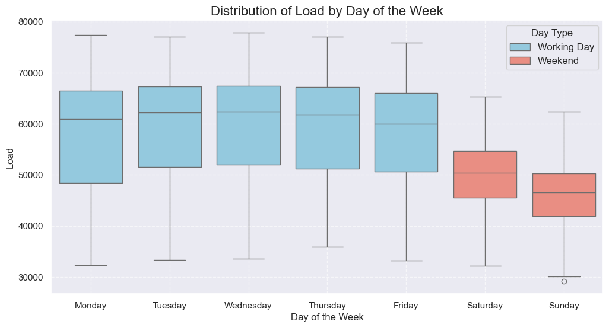
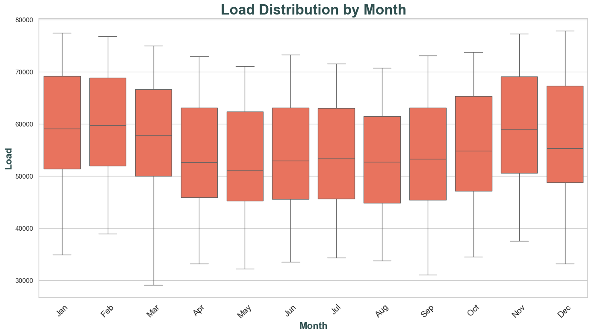
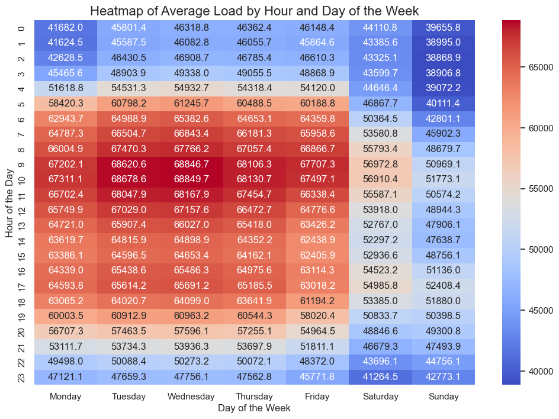
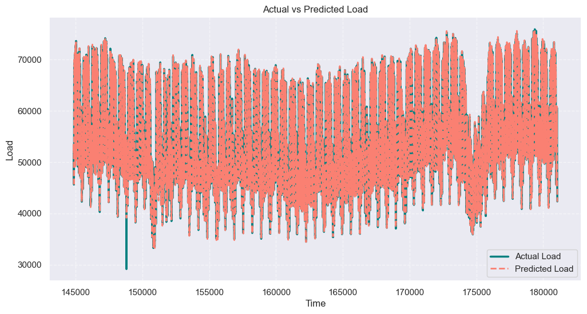
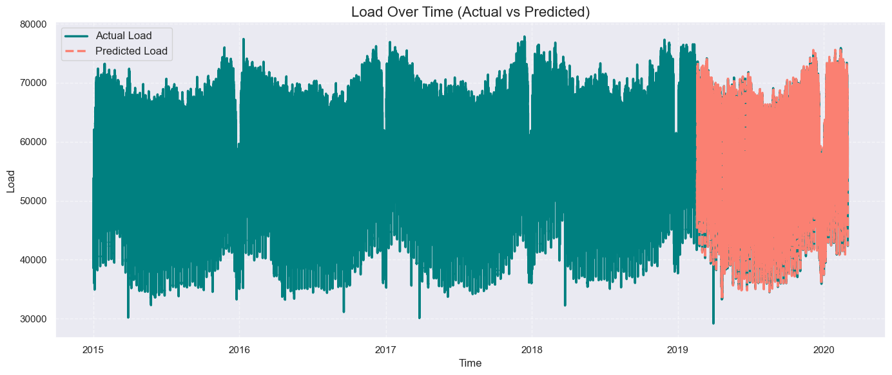
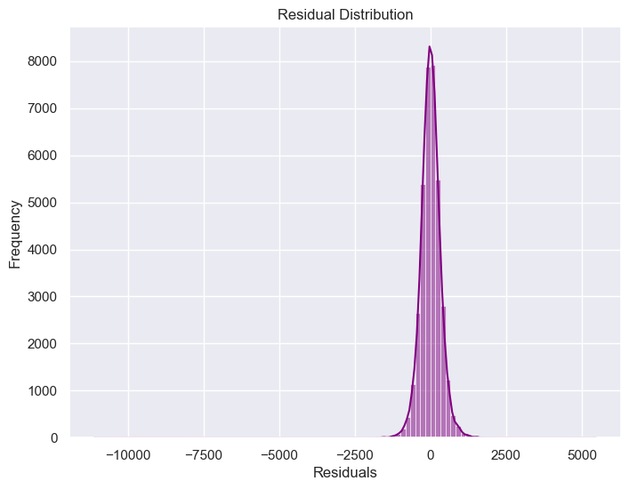

# Introduction

Goal of this project is to enchance my Data Science skills in forecasting. Dataset for this project is free and available on [Kaggle](https://www.kaggle.com/datasets/francoisraucent/western-europe-power-consumption/data).

# Background

The dataset I used contains information about the power consumption in western Europe form January 2015 up to August 2020 in Megawatts (MW).

Below is an example of the data in this table. There are is information about MW consumed in each 15 minutes (load).

| Nr  | start                     | end                       | load    |
| --- | ------------------------- | ------------------------- | ------- |
| 5   | 2015-01-01 01:15:00+00:00 | 2015-01-01 01:30:00+00:00 | 40312.0 |
| 6   | 2015-01-01 01:30:00+00:00 | 2015-01-01 01:45:00+00:00 | 39984.0 |
| 7   | 2015-01-01 01:45:00+00:00 | 2015-01-01 02:00:00+00:00 | 39626.0 |
| 8   | 2015-01-01 02:00:00+00:00 | 2015-01-01 02:15:00+00:00 | 39472.0 |
| 9   | 2015-01-01 02:15:00+00:00 | 2015-01-01 02:30:00+00:00 | 39217.0 |

# Tools I used

To create a model that predicts energy consumption I worked with following tools:

- **Pandas** library for working with dataframes
- **matplotlib.pyplot** and **seaborn** libraries for plotting the data
- **sklearn** library for metrics and splitting data
- **xgboost** model as a key technology for predictions

# Data analysis

Before training the model each dataset should be examined and prepared for training.
After loading the data and extracting time-based features it was important to generate lag reatures because to give the model better chance to figure out features of this time-series data.

Then I visualised the data to visually observe it. Here is the lineplot:

_Lineplot visualizes load over time from 2015 to 2020_

As it clearly seen at some point in 2020 consumption dropped significantly, the reason for that - COVID-19 restrictions. I decided to exclude this part of the data because my plan was to build a predictive model for typical electricity consumption patterns.

Next steps were to observe data in more details to see whether there are other patterns that could affect predictions of the model.

I checked average load by hour of the day

_Barplot visualizes load over time by hour of the day_

Distribution of load by the day of the week

_Boxplot visualizes distribution of load by the day of the week_

Distribution of load by month

_Boxplot visualizes distribution of load by month_

And looked at the heatmap of average load by hour and day of the week

_Heatmap visualizes average load by hour and day of the week_

Because all graphs showed some clear and repeated patterns I went to the next step.

# Data preparation, regression model training and prediction on the test set

Data was split into train and test parts in 80% to 20% proportion.

```python
# Define features (X) and target (y)
X = df[['hour', 'day_of_week', 'month', 'load_t-1', 'load_t-2', 'load_t-3', 'load_t-4', 'load_t-5']]
y = df['load']

# Split into training and testing sets (80/20 split)
X_train, X_test, y_train, y_test = train_test_split(X, y, test_size=0.2, shuffle=False)
```

As a machine learning model for this project was chosen [XGBoost](https://www.nvidia.com/en-us/glossary/xgboost/), which stands for Extreme Gradient Boosting, is a scalable, distributed gradient-boosted decision tree (GBDT) machine learning library. It provides parallel tree boosting and is the leading machine learning library for regression, classification, and ranking problems.

```python
# Initialize the XGBoost model
model = xgb.XGBRegressor(objective='reg:squarederror', max_depth=6, learning_rate=0.05, n_estimators=1000)

# Train the model
model.fit(X_train, y_train)

# Make predictions on the test set
y_pred = model.predict(X_test)
```

Visualised results of the training looks promising:

_Lineplot visualizes actual vs predicted load_

Even better it fits in the trend when plotted on top of load over time:

_Lineplot visualizes load over time (actual vs predicted)_

Still there is always other than visual analysis needed.

Residual analysis is a crucial step in model evaluation that examines the differences between the actual and predicted values, called residuals. It helps to assess how well the model fits the data and identify any patterns or issues in the predictions.


_Histplot visualizes residual distribution_

The residual distribution appears to be relatively centered around 0, which is a good sign. However, to fully evaluate whether it's a "good" residual distribution following points should be considered:

1. **Symmetry**: The distribution should be roughly symmetric about 0. In this case, it does appear symmetric.

2. **Concentration Around Zero**: Most residuals should be close to 0, with fewer residuals further away. The plot shows a high concentration of residuals around 0, which is ideal.

3. **Outliers**: Are there any extreme values far from the mean? In this plot, the tails are narrow, suggesting no significant outliers, which is a positive sign.

4. **Normality**: Ideally, residuals should follow a normal (Gaussian) distribution. While this looks reasonable, a normality test (e.g., Shapiro-Wilk or QQ plot) could be performed to confirm.

5. **Residual Spread**: The variance of residuals should be consistent (homoscedastic). This cannot be determined from this plot alone.

This distribution generally suggests that the model is performing well, but the additional checks mentioned above would give a more comprehensive assessment. However due to a not productional character of this project I desided as a final test to check my model' performance against some standart models like Linear Regression or Decision Trees available with sklearn library. Mean squared error results:

- Linear Regression MSE: 173135.03
- Decision Tree MSE: 395889.83
- **XGBoost MSE: 110250.15**
